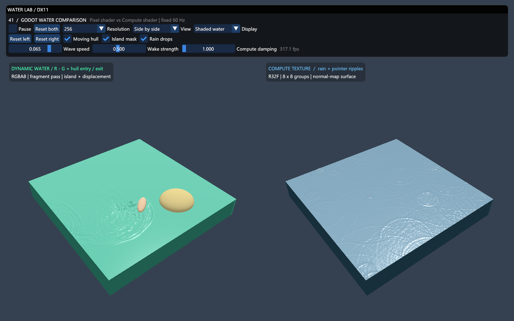

# 41 Godot Water Comparison / Godot 水波着色器对比

在一个 Direct3D 11 程序中展示 DynamicWaterDemo 与 Godot 官方 Compute Texture 的两种水波效果。



## 构建与运行

需要 Windows、支持 Feature Level 11.0 的显卡、Visual Studio C++ 桌面工具和 Windows SDK。运行不依赖 Godot，无需下载模型或 HDRI。

在本目录用 PowerShell 执行：

```powershell
.\Build.ps1 -Configuration Release -Validate
```

脚本自动查找 CMake，默认生成到仓库的 `build-water-comparison/Release`，并输出 exe 路径。可通过 `-BuildDirectory` 指定其他构建目录。Debug 验证使用 `-Configuration Debug`，需要 Windows 图形工具提供 D3D11 调试层。

也可以从仓库根目录生成整体解决方案，只编译新增目标：

```powershell
cmake -S . -B build-local -A x64 "-DCMAKE_POLICY_VERSION_MINIMUM=3.5"
cmake --build build-local --config Release --target 41_Godot_Water_Comparison --parallel 4
```

CMake 4 的兼容参数用于仓库中的第三方旧 CMakeLists；单独构建本示例不需要。请使用新构建目录，避免混用已有 VS2019 缓存。

xmake 入口也已注册，目标名为 `41_Godot_Water_Comparison`；本次实测使用 CMake/MSVC。HLSL 在 VS 的 Shaders 分组显示，并在程序启动时按 Shader Model 5.0 编译。构建自动复制 Shaders 与 Assets，程序自动以 exe 所在目录定位资源。

## 操作

| 控件 | 行为 |
| --- | --- |
| 左键点击或按住水面 | 在对应水面注入扰动 |
| 右键拖动、滚轮 | 同步旋转视角、缩放 |
| Pause | 暂停两种模拟 |
| Reset both / left / right | 清空两种或指定水面的历史状态 |
| Resolution | 128、256、512；切换重置历史 |
| View | 并排、仅 Dynamic Water、仅 Compute Texture |
| Display | 水面着色、高度图、船体遮罩；右侧没有船体遮罩，显示黑色 |
| Moving hull / Island mask | 左侧移动船体扰动、原陆地遮罩 |
| Rain drops | 右侧随机雨滴 |
| Wave speed / Wake strength | 左侧传播速度、造浪强度 |
| Compute damping | 右侧波动衰减 |

## 工程结构

沿用仓库 `Common/d3dApp` 的窗口、交换链、计时器及 ImGui 后端，入口采用 `Main.cpp → GameApp`。新增源码与 Shaders 位于独立第 41 项目录，没有修改已有示例的渲染代码。

独立 CMake 目标仅编译所需公共框架文件，不引入本例未使用的 Assimp 模型模块。根 CMake 与 xmake 均已增加第 41 项入口。

| 文件 | 职责 |
| --- | --- |
| `Main.cpp` | 启动、资源路径、验证入口和异常日志 |
| `GameApp.cpp/.h` | 控件、固定时间步、相机、对比显示及验证 |
| `WaterSimulation.cpp/.h` | 纹理创建、PS/CS 调度、历史纹理轮换 |
| `Shaders/Dynamic_PS.hlsl` | R/G 波动方程、船首船尾注入、陆地边界 |
| `Shaders/Collision_PS.hlsl` | 演示用椭圆船体水线遮罩 |
| `Shaders/Compute_CS.hlsl` | 官方 Compute Texture 的 8×8 计算着色器 |
| `Shaders/Water_VS.hlsl` | 网格、左侧顶点位移、辅助模型 |
| `Shaders/Water_PS.hlsl` | 两种高度梯度法线、颜色、高光 |
| `Assets/land.png` | 当前 DynamicWaterDemo 的原陆地遮罩 |

## 两种波纹的实现

### DynamicWaterDemo

使用 `RGBA8_UNORM` 高度纹理，R 保存正向分量，G 保存负向分量，实际波高取 R−G。像素着色器向 RTV 写入：

```text
next = a × 四邻居之和 + (2 − 4a) × current − previous
a = (wave_speed × resolution / 60)²
```

当前与上一轮船体遮罩由零变成非零时注入正波，由非零变为零时注入负波。陆地遮罩非零处清空两分量。保留原 UNORM 的截断与量化行为。

左侧水面读取高度进行顶点位移，再利用邻域高度差构造法线，保留绿色水块、边缘过渡和船体区域抑制位移的表现。

### 官方 Compute Texture

使用 `R32_FLOAT`，两个 SRV 输入和一个 UAV 输出，每组 8×8 线程。核心公式与本机官方示例一致：

```text
next = 2 × current − previous + 0.25 × (四邻居之和 − 4 × current)
next *= 1 − damp × 0.001
命中雨滴或鼠标像素时：next = 扰动强度
next = max(next, 0)
```

保留官方将负高度截为零的行为。水面与官方一样主要通过高度差生成法线，没有启用顶点位移。环境光照使用本例的解析天空，使雨滴环状波纹容易观察。

### 数据和时间步

两种实现都用三张 GPU 高度纹理轮换“当前、上一步、输出”，正常运行不读回整张高度图。左侧另有两张交界遮罩纹理轮换。切换用途前显式解绑 SRV/RTV/UAV，避免 DX11 资源读写冲突。

两种模拟均以固定 60 Hz 推进，单帧接受的时间增量上限为 0.1 秒，避免挂起后大量补算。Readback 仅用于验证。与当前 Godot 4 移植版随渲染帧更新不同，本例正常负载下的模拟速度与渲染帧率解耦。

## 移植范围

本例展示两种水波 shader，并非重建整个 Godot 场景：

- 左侧船体使用程序生成模型及椭圆水线遮罩持续制造正负扰动。未移植 Godot 的船体相机裁剪流程、刚体浮力、木箱与棕榈树。
- Godot 材质光照、透明混合和环境资源由 DX11 光照及解析天空近似代替，不保证逐像素相同。左侧水块采用不透明合成。
- 分辨率改变模拟纹理，显示网格固定为 128×128 个单元；右侧保留法线波纹表现。
- 辅助船体和岛屿模型不构成通用三维流体碰撞系统。

## 自动验证

exe 支持 `--validate`，运行后自动退出，结果写入同目录 `validation.txt`。失败退出码非零，异常写入 `error.log`；另输出 `validation-comparison.png`。

验证覆盖：

1. 两条真实 GPU 管线各运行 12 步，与独立 CPU 波动公式对照。
2. 19×19 非工作组整数倍尺寸，验证 Compute 越界防护。
3. 船体进入时正波、离开时负波的注入。
4. 两水面持续运行 240 帧，检查有限数值、活跃波纹并截图。
5. 三种布局、三种显示模式、暂停、指针扰动注入。
6. 128/256/512 分辨率重建、清空历史、交换链及深度缓冲缩放。
7. Debug 构建检查 D3D11 调试层警告与错误。

## 来源和许可

- [DynamicWaterDemo](https://github.com/CaptainProton42/DynamicWaterDemo)，John Wigg / CaptainProton42，MIT。依据当前 Godot 4.7.2 项目中的 `simulation.gdshader`、`water.gdshader` 移植；许可见 `Assets/DynamicWater-LICENSE.txt`。
- [官方 Compute Texture](https://github.com/godotengine/godot-demo-projects/tree/master/compute/texture)，MIT。依据本机示例的 `water_compute.glsl`、`water_shader.gdshader` 移植；许可见 `Assets/Godot-LICENSE.txt`。
- DX11 框架及公共工具沿用本仓库许可证与文件头。
